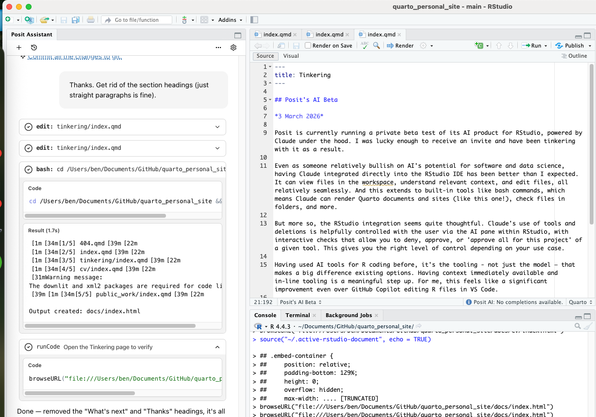

## Posit's AI Beta

*3 March 2026*

Posit is currently running a private beta test of its AI product for RStudio, powered by Claude under the hood. I was lucky enough to receive an invite and have been tinkering with it as a result. The integration is in a new left-hand pane, like you can see in the image below.

Even as someone relatively bullish on AI's potential for software and data science, having Claude integrated directly into the RStudio IDE has been better than I expected. It can view files in the workspace, understand relevant context, and edit files, all relatively seamlessly. And this extends to built-in tools like bash commands, which means Claude can render Quarto documents and sites (like this one!), check files in folders, and more.

But more so, the RStudio integration seems quite thoughtful. Claude's use of tools and deletions is helpfully controlled with the user via the AI pane within RStudio, with interactive checks that allow you to deny, approve, or 'approve all for this project' of a given tool. This gives you the right level of control depending on your use case. Below is an example of Claude's workflow for rejecting tool use in the AI pane.

Having used AI tools for R coding before, it's the tooling (not just the model) that makes a big difference over existing options. Having context immediately available and in-line tooling is a meaningful step up. For me, this feels like a significant improvement even over GitHub Copilot editing R files in VS Code.

Next steps in my testing for this tooling will include more detailed R package development, as well as heavier data tasks like visualisation and running complex data workflows involving modelling.

I also wonder whether Posit will allow different models to be integrated into the harness, which could improve compatibility across enterprise environments served by AI providers other than Anthropic.

Regardless — thanks to Posit for producing this great product. It's a credit to their team, and I can't wait to keep using it even after the private beta. Thanks also to my new R coding buddy - this post benefited from Claude's helpful edits.
